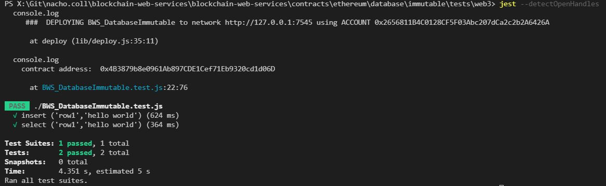

# Blockchain Web Services ETHEREUM Contracts

ETHEREUM contracts you can call using Blockchain Web Services.

## BWS_DatabaseImmutable (Version 2)

### ropsten

| Account Owner                              | Contract                                                                                                |
| ------------------------------------------ | ------------------------------------------------------------------------------------------------------- |
| 0x9089Db83F0590EC2eD01A5Eb4F8584Dd6F4bDaC7 | [ropsten.etherscan.io](https://ropsten.etherscan.io/address/0x81D575b53239BcB4332bb1608a21F1A17035deeA) |

## How To

### Build

Run `build.ps1` for building code (check [solc](https://docs.soliditylang.org/en/v0.8.13/installing-solidity.html) website for options). Script will check for same folder contract file and compile them into the `build` folder you will use to test and deploy:

```ps
Get-ChildItem -Path  ${PSScriptRoot}/*.sol | ForEach-Object { Write-Output $_.Name } | ForEach-Object { docker run -v ${PSScriptRoot}:/sources ethereum/solc:stable -o /sources/build --abi --bin /sources/$_ --overwrite }
```

### Test

We use [jest](https://jestjs.io/) and [Ganache](https://www.trufflesuite.com/ganache) as the local blockchain network to test contracts calling web3 library:

- Run `npm install` to get required dependencies (if not already done),
- launch [Ganache](https://trufflesuite.com/docs/ganache/) and update `config.json` file with the account keys and the network variables you want to use.
- and then just run `jest` command.

You should get something like:



### Deployment

We use web3 code to deploy contracts,

- Go to `deploy` folder,
- run `npm install`if required,
- execute `node deploy network=network-name contract=contract-name`.

The network name should match on `secrets.json` file (check Notes), and contract-name must match contract file name on `build` folder.

## Notes

### Configure secrets.json

In order to run/test smart contracts locally you need to create and configure the relevant secrets in `secrets.json` file. Check your local [Ganache](https://www.trufflesuite.com/ganache) for getting the values for local testing.

```json
{
  "local": {
    "endpoint": "http://127.0.0.1:7545",
    "address": "0x2656811B4C0128CF5F03388493Ca2c2b2A6426A",
    "private": "4d6ca7a5259e6020b3094e63f9733004382f6f26d24d941ed1646d588a27b50",
    "mnemonic": "local advice wait monday tide bike regret circle uncle armed indoor sheriff"
  }
}
```
