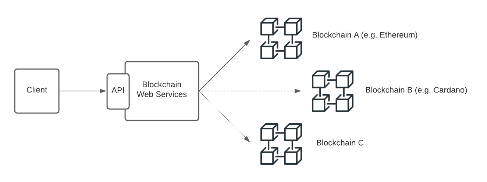

# A New Generation of Web Services

Blockchain technologies are rising at an incredible rate.

The 1st generation (aka Bitcoin) delivered the required trust for *financial* transactions; Just a few years later a 2nd generation (aka Ethereum) stretched to countless scenarios through the use of Smart Contracts; Now, a 3rd generation set of initiatives is already pushing hard to support scalability and mature growth.

But how easy is to use Blockchain services?

**Blockchain Web Services** end goal is to offer a simplified API approach to interact with well-documented smart contracts without requiring to get multiple blockchain accounts or get the full blockchain know-hows.

A simple usage workflow:

- user creates an account (a single account to interact with multiple blockchain initiatives),
- as interacting with Blockchains requires gas (money), the user buys some USD credits (similar as paying for API usage),
- using those credits when required, the user calls Blockchain Web Services well-documented smart-contracts (as an initial approach Blockchain Web Services will impersonate access to blockchains [Reddit Community Open Topic](https://www.reddit.com/r/BlockchainWebServices/comments/q00eaq/api_architecture_for_blockchain_web_services/?utm_source=share&utm_medium=web2x&context=3))

## Roadmap

- [In process] Brainstorming on limitations (e.g. impersonation)
- [In process] Define middleware architecture
- [In process] Middleware implementation for account creation, funding credits and smart-contracts calling.
- one smart-contract API interface for ETHEREUM
- one smart-contract API interface for CARDANO

## Become a Founder

Do you find the initiative exciting and want to help driving it? Get in touch with a member:

[Nacho Coll](https://www.linkedin.com/in/nacho-coll/)
