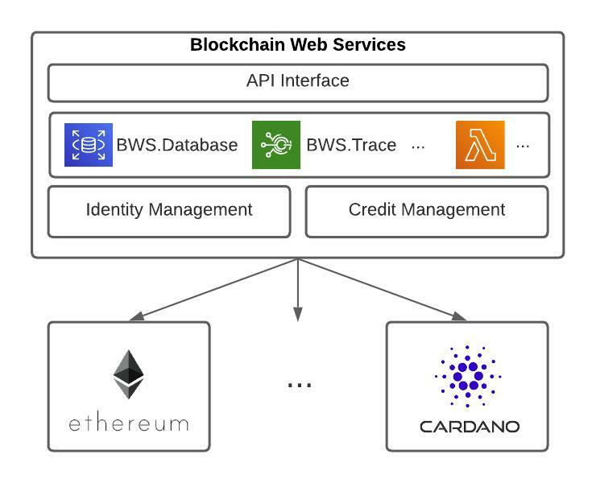

# BWS: Blockchain Web Services

Blockchain technologies are rising at an incredible rate.

The 1st generation (aka Bitcoin) delivered the required trust for _financial_ transactions; Just a few years later a 2nd generation (aka Ethereum) stretched to countless scenarios through the use of Smart Contracts; Now, a 3rd generation set of initiatives is already pushing hard to support scalability and mature growth.

But how easy is to use Blockchain services?

**Blockchain Web Services** offers a set of services on top of blockchain(s) to enable companies, individuals and governments embrace a new era of trusted services while keeping the focus on their business models and how they add value.

The same way AWS and the cloud era is transforming how companies interact with IT infrastructure, BWS will transform how companies interact with Blockchain.

 

  

 

## Roadmap

### [Q1 2022] **BASE STATION** - <i class="fa-solid fa-check-double"></i>

- Define middleware architecture - <i class="fa-solid fa-check"></i>
- Middleware implementation for account creation, funding credits and smart-contracts calling - <i class="fa-solid fa-check"></i>
  - [bws.ninja backoffice](https://bws.ninja/)
- Initial API documentation - <i class="fa-solid fa-check"></i>
  - [doc.bws.ninja](https://doc.bws.ninja/)

### [Q2 2022] **THE ROCKET** - <i class="fa-solid fa-check-double"></i>

- Ropsten mining for users to freely test BWS services.
  - [BWS Ropsten Address mining](https://ropsten.etherscan.io/address/0x9089Db83F0590EC2eD01A5Eb4F8584Dd6F4bDaC7#mine)
- First Blockchain Web Services Product Service:
  - Database: [Ethereum.Database](https://github.com/NachoColl/blockchain-web-services/tree/Ethereum.Database.Immutable/contracts/ethereum)
- Deploy [Ethereum.Database](https://doc.bws.ninja/#database) to:
  - Ethereum (ropsten + mainnet)
- BWS Database product service use-case demo:
  - [MegaLock.ninja](https://megalock.ninja)

### [Q3 2022] **COUNT DOWN**

- Deploy [Ethereum.Database] to:
  - Polygon
- Implement new Product Services
  - **NFT** for NFT use cases.
- Website initial iteration.
  - [bws.nina](https://bws.ninja/) copy & design

### [Q4 2022] **MOON LANDING**

- Implement new Product Services
  - **Trace** for Supply Chain Management
- Blockchain Web Services DAO
- First online service consuming Blockchain Web Services products.
