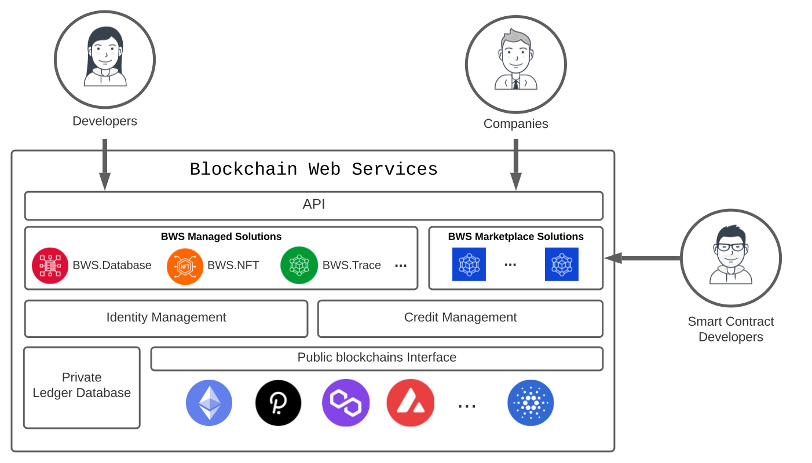

<link rel="stylesheet" href="https://cdnjs.cloudflare.com/ajax/libs/highlight.js/11.4.0/styles/atom-one-dark.min.css">

 White Paper

 
(version under construction)
 

Blockchain technologies are rising at an incredible rate. The 1st generation (aka Bitcoin) delivered the required trust for financial transactions; Just a few years later a 2nd generation (aka Ethereum) stretched to countless scenarios through the use of Smart Contracts; Today, a set of new initiatives is already pushing hard to support scalability and mature growth.

We believe blockchain should transform society for the better and while cryptos have raised worldwide attention, the real win must come from Infinite Games founded on a decentralized, transparent and trusted framework. 

Blockchain beyond cryptos must wake up shifts from-a-few to everyone.

## Fundamentals

Blockchain Web Services is a set of solutions on top of blockchain(s) to help companies, individuals and governments embrace the blockchain revolution. It aims to spread the overall adoption by dropping blockchain infrastructure complexities from creative workflows, enabling anyone to focus on building solutions as they are currently used to.

  
<i class="fa-solid fa-quote-left"></i>&nbsp;The Amazon Web Services for the Blockchain(s)&nbsp;<i class="fa-solid fa-quote-right"></i>

### Raising Adoption

The initial hype on Smart Contracts is getting weighed by the ecosystem complexities. To list some big rocks our solution wants to break, a company and even an experienced developer get quickly overloaded by:

 <ul class="fa-ul">
    <li><i class="fa-regular fa-square"></i>having to build from scratch Smart Contracts that may already be available in the market,</li>
    <li><i class="fa-regular fa-square"></i>proving to stackeholders the Smart Contract is secure and well-coded,</li>
    <li><i class="fa-regular fa-square"></i>managing blockchain addresses, store and secure the keys, and</li>
    <li><i class="fa-regular fa-square"></i>having to trade cryptos to consume blockchain on most of the interactions.</li>
  </ul>

We want to help those companies, governments and developers by:

 <ul class="fa-ul">
    <li><i class="fa-regular fa-square-check"></i>building a <strong>Unified Blockchain(s) API</strong> for developers and companies to consume Blockchain(s) as any service they are already used to,</li>
    <li><i class="fa-regular fa-square-check"></i>provide a <strong>realtime Blockchain fees trading</strong> mechanism to transparently manage any required fund,</li>
    <li><i class="fa-regular fa-square-check"></i>set an initial list of <strong>built-in solutions for the most demanded use cases</strong>, from Database primitives to end-to-end solutions for Digital Identity, consume Data Assets, Supply Chain Management and many more, but also,</li> 
    <li><i class="fa-regular fa-square-check"></i>provide a <strong>Smart Contract Marketplace</strong> to enable companies to easily consume advanced Smart Contract developers' solutions.</li>
  </ul>

## A Unified Blockchain(s) API

Blockchain Web Services will provide a unified API definition to execute Blockchain Smart Contract operations. Developers will be ready to go in minutes as they are used to and without having to learn or deal with blockchain infrastructure(s) topics.

A simple 'https://api.bws.ninja/v1/call' API call will be enough to start executing a Blockchain smart contract operation.

<pre><code class="js">var parameters = {
  contract: "Ethereum.Database.Immutable",
  version: 2,
  network: "ropsten",
  operation: "insertBytes32",
  parameters: {
    key: "a-key",
    value: "Hello World!",
  },
};

$.ajax({
  method: "POST",
  url: "https://api.bws.ninja/v1/call",
  data: JSON.stringify(parameters),
  headers: {
    "Content-Type": "application/json",
    "X-Api-Key": "ExV0dDszQ8QgsTVnevddpbB8cUaAfPs432ntVF8g0",
  },
  dataType: "json",
  success: function (response) {
    console.log(response);
  },
  error: function (xhr, textStatus, errorThrown) {
    console.log(xhr);
  },
});</code></pre>

### Realtime Blochchain Fees Trading

To execute Smart Contracts and write into Blockchain(s) you need fuel (funds that will get consumed) - it is a control mechanism to run code and to help fund the community. If a Real State company, for example, wants to write to blockchain their contract's signatures, every signature operation call will require the company to have some funds available. If they plan to use the Ethereum blockchain, they will have to manage how to buy some ETH just before every call (fiat exchange value may go up or down in time).

We propose that our unified API executes any required funding transparently so users don't have to deal with it.

  

As a result, Blockchain Web Services customers will pay a bill at the end of the period as they currently do when consuming any other online service.

## A Smart Contract Marketplace Community

As previously mentioned, we will provide solutions that satisfy some of the market's most demanded use cases. We will start our journey by adding Database primitives to read and write data to the blockchain(s) and move up by adding a Supply Chain Management API or offering a Data/AI assets solution, among others.

Even more exciting, we want to engage ourselves in the community-embracing approach the blockchain revolution has introduced. 

We will build a Marketplace of Smart Contracts where experienced blockchain developers will publish their work and be able to get a profit from it - and companies will be able to consume an extended set of solutions as part of Blockchain Web Services API. 

## Utility Token

We propose Blockchain Web Services to rule a token operating under the following principles.

First, we want the community to help, participate, fund, and get rewards for promoting and consuming the proposal we defined.

Second, we aim to work for the vision we committed to — a massive increase in blockchain adoption through companies and governments implementing new solutions that require transparency and trust.

### Tokenomics 

[under construction]

Blockchain Web Services token will get utilized in the following use cases:

- API consumers (platform customers) will require the token to execute Smart Contracts API calls.

  

- Marketplace Smart Contracts creators (Smart Contracts solution developers) will get a token reward whenever a platform customer consumes their solution.

  

 

On the other side, we also plan to use the token to:

- fund Smart Contract developers to add new solutions to the platform, and
- fund the initial development and launch of the platform.

 

## Roadmap

### [Q1 2022] **BASE STATION** - <i class="fa-solid fa-check"></i>

- Define middleware architecture.
- Middleware implementation for account creation, funding credits and smart-contracts calling:
  - [bws.ninja backoffice](https://bws.ninja/)
- Initial API documentation:
  - [doc.bws.ninja](https://doc.bws.ninja/)
- Activate Stripe for customers to buy USD credits.
  - Setup for bws.ninja staging [staging.bws.ninja](https://staging.bws.ninja)

### [Q2 2022] **THE ROCKETS** - <i class="fa-solid fa-check"></i>

- Ropsten ~~mining~~ PoS (update 18/06/2022) for users to freely test BWS services.
  - ~~[BWS Ropsten Address mining](https://ropsten.etherscan.io/address/0x9089Db83F0590EC2eD01A5Eb4F8584Dd6F4bDaC7#mine)~~
  - [BWS Ropsten PoS](https://ropsten.beaconcha.in/validator/877c91d2376f731a0f621c7848c0cd9d0a2622e91d68922838ef6b4dd5d8256e46e86cf06f5979b32103ed706d0c70ed)
- First Blockchain Web Services Product Service:
  - Database: [Ethereum.Database](https://github.com/NachoColl/blockchain-web-services/tree/Ethereum.Database.Immutable/contracts/ethereum)
- Deploy [Ethereum.Database](https://doc.bws.ninja/#database) to:
  - Ethereum (ropsten + mainnet)
- BWS Database product service use-case demo:
  - [MegaLock.ninja](https://megalock.ninja) (ropsten)

### [Q3 2022] **COUNT DOWN** - <i class="fa-solid fa-check"></i>

- Implement ETH trading to call mainnet Smart contracts
  - Setup Stripe payments in bws.ninja production
  - Setup FTX.us partnership
  - Implement Trading middleware
- Website initial iteration.
  - [bws.ninja](https://bws.ninja/) copy & design

### [Q4 2022] **IGNITION**

- Deploy [Ethereum.Database] to Polygon zkEVM / zkSync 2.0
- Build **bws.ninja [NFT]** solution for NFT use cases (Ethereum)
- Define Tokenomics

### [Qx 2023] **SPACE COLONIZATION**

- Launch Token
- Built-in **bws.ninja** solutions for:
  - Data Assets / AI Workflows
  - Identity Management
  - Supply Chain Management
- Blockchain Web Services adoption growth plan threads:
  - **Blockchain Consulting** to help businesses implement blockchain through Blockchain Web Services 
  - **Smart Contracts Marketplace**

