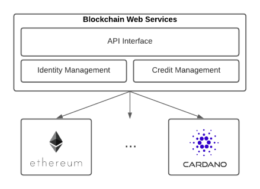

# A New Generation of Web Services

Blockchain technologies are rising at an incredible rate.

The 1st generation (aka Bitcoin) delivered the required trust for _financial_ transactions; Just a few years later a 2nd generation (aka Ethereum) stretched to countless scenarios through the use of Smart Contracts; Now, a 3rd generation set of initiatives is already pushing hard to support scalability and mature growth.

But how easy is to use Blockchain services?

**Blockchain Web Services** end goal is to offer a simplified API approach to interact with well-documented smart contracts without requiring to get multiple blockchain accounts or get the full blockchain know-hows.

  

A simple usage workflow:

- user creates an account (a single account to interact with multiple blockchain initiatives),
- as interacting with Blockchains requires gas (money), the user buys some USD credits (similar as paying for API usage),
- using those credits when required, the user calls Blockchain Web Services well-documented smart-contracts.

## Roadmap

### [Q4 2021] **THE ROCKET**

- Define middleware architecture
- Middleware implementation for account creation, funding credits and ETHEREUM smart-contracts calling
  - [staging.bweb.services](https://staging.bweb.services/)
- Single smart-contract operation API interface for ETHEREUM
  - Ropsten: [first Database operation](https://github.com/NachoColl/blockchain-web-services/tree/Ethereum.Database.Immutable/contracts/ethereum).
  - Ethereum: [In Progress]
- Initial API documentation at [doc.bweb.services](https://doc.bweb.services/)

### [Q1 2022] **MOON LANDING**

- Initial smart-contracts set of services for ETHEREUM

### [Q2 2022] **GOING TO MARS**

- define middleware for CARDANO smart-contracts calling
- one smart-contract API interface for CARDANO

### [Q3 2022] **THE COLONY**

- initial smart-contracts service list for CARDANO

### [Q4 2022/2023] **HOME SWEET HOME**

- SaaS sites examples for specific smart-contract sets/features

## Become a Founder

Do you find the initiative exciting and want to help driving it? Get in touch with a member.

[Nacho Coll](https://www.linkedin.com/in/nacho-coll/)
