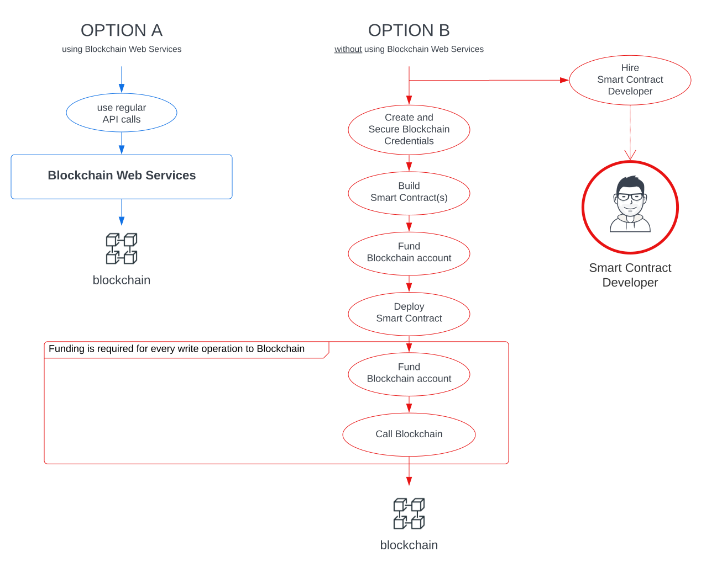

 White Paper

 
Blockchain technologies are rising at an incredible rate. The 1st generation (aka Bitcoin) delivered the required trust for financial transactions; Just a few years later a 2nd generation (aka Ethereum) stretched to countless scenarios through the use of Smart Contracts; Today, a set of new initiatives is already pushing hard to support scalability and mature growth.

We believe **blockchain should transform society for the better** and while cryptos have raised worldwide attention, the real win must come from Infinite Games founded on a global and trusted framework based on decentralized models and transparency: **blockchain beyond cryptos** must wake up shifts from-a-few to everyone.

## Fundamentals

Blockchain Web Services is a set of services on top of blockchain(s) to help companies, individuals and governments embrace a new era of trusted services while keeping the focus on their business models and how they add value.

  
<i class="fa-solid fa-quote-left"></i>&nbsp;The Amazon Web Services for the Blockchain(s)&nbsp;<i class="fa-solid fa-quote-right"></i>

### Raising Adoption

Blockchain ecosystem is still too complex for mass adoption, as a few examples, starting a blockchain journey today requires to:

 <ul class="fa-ul">
    <li><i class="fa-regular fa-square"></i>build from scratch Smart Contracts that may already be available in the market,</li>
    <li><i class="fa-regular fa-square"></i>prove to stackeholders their new Smart Contracts are secure and well-coded,</li>
    <li><i class="fa-regular fa-square"></i>manage blockchain addresses, secure keys, and</li>
    <li><i class="fa-regular fa-square"></i>trade cryptos to consume blockchain on every transaction.</li>
  </ul>

Blockchain Web Services will offer a set of services to satisfy such market requirements:

 <ul class="fa-ul">
    <li><i class="fa-regular fa-square-check"></i>a <strong>unified Blockchain(s) API</strong> for developers and companies to consume Blockchain(s) as any service they are used to,</li>
    <li><i class="fa-regular fa-square-check"></i><strong>realtime Blochchain fees trading</strong> to transparently manage any required fund,</li>
    <li><i class="fa-regular fa-square-check"></i>a set of <strong>built-in solutions for the most demanded uses cases</strong>, from Digital Identity to Supply Chain management and many more,</li>
    <li><i class="fa-regular fa-square-check"></i>a <strong>Smart Contract Marketplace</strong> to easely consume advanced Smart Contract developers solutions.</li>
  </ul>

#### A Unified Blockchain(s) API

Blockchain Web Services provides a unified API to execute Blockchain Smart Contract transactions: a simple 'https://api.bws.ninja/v1/call' API call is enough to save data to Ethereum without the need to manage keys or worry about blockchain fees.

  

Companies do not have to build Smart Contracts from scratch or worry about Blockchain complexities, and most of the use cases that the Blockchain adds value to will be available as a native API solution (built by us) or as part of the Smart Contracts marketplace.

.. graph showing solutions and marketplace ...

#### Realtime Blochchain Fees Trading

To execute Smart Contracts and write into Blockchain(s) you need fuel (funds that will get consumed): it is a control mechanism to run code and it also helps maintaining the community that support the decentralized infrastructure. 

.. graph

For developers and companies running a blockchain solution, having to manage fuel means funds have to be available real-time. If a Real State company solution writes to Ethereum blockchain a signature to manage trust for contract stackeholders, every signature will require the company to have some ETH available in their blockchain account. 

It is also important to note that you can not hold ETHs in your account in advance, as the value for those may get depreciated.

The best option is to exchange as close as possible to your blockchain Smart Contract call.

  

Blockchain Web Services does real-time trading when calling a transaction.

## Roadmap

### [Q1 2022] **BASE STATION** - <i class="fa-solid fa-check"></i>

- Define middleware architecture.
- Middleware implementation for account creation, funding credits and smart-contracts calling:
  - [bws.ninja backoffice](https://bws.ninja/)
- Initial API documentation:
  - [doc.bws.ninja](https://doc.bws.ninja/)
- Activate Stripe for customers to buy USD credits.
  - Setup for bws.ninja staging [staging.bws.ninja](https://staging.bws.ninja)

### [Q2 2022] **THE ROCKETS** - <i class="fa-solid fa-check"></i>

- Ropsten ~~mining~~ PoS (update 18/06/2022) for users to freely test BWS services.
  - ~~[BWS Ropsten Address mining](https://ropsten.etherscan.io/address/0x9089Db83F0590EC2eD01A5Eb4F8584Dd6F4bDaC7#mine)~~
  - [BWS Ropsten PoS](https://ropsten.beaconcha.in/validator/877c91d2376f731a0f621c7848c0cd9d0a2622e91d68922838ef6b4dd5d8256e46e86cf06f5979b32103ed706d0c70ed)
- First Blockchain Web Services Product Service:
  - Database: [Ethereum.Database](https://github.com/NachoColl/blockchain-web-services/tree/Ethereum.Database.Immutable/contracts/ethereum)
- Deploy [Ethereum.Database](https://doc.bws.ninja/#database) to:
  - Ethereum (ropsten + mainnet)
- BWS Database product service use-case demo:
  - [MegaLock.ninja](https://megalock.ninja) (ropsten)

### [Q3 2022] **COUNT DOWN** - <i class="fa-solid fa-check"></i>

- Implement ETH trading to call mainnet Smart contracts
  - Setup Stripe payments in bws.ninja production
  - Setup FTX.us partnership
  - Implement Trading middleware
- Website initial iteration.
  - [bws.ninja](https://bws.ninja/) copy & design

### [Q4 2022] **IGNITION**

- Deploy [Ethereum.Database] to Polygon zkEVM / zkSync 2.0
- Build **bws.ninja [NFT]** solution for NFT use cases (Ethereum)
- Define ICO White Paper

### [Qx 2023] **SPACE COLONIZATION**

- Launch ICO
- Build **bws.ninja** API solutions for:
  - Identity Management
  - Supply Chain Management
- Blockchain Web Services adoption growth plan threads:
  - **BWS Consulting** Help businesses implement blockchain through Blockchain Web Services 
  - **BWS Products** Build Commercial solutions on blockchain hypes (e.g. NFT Marketplace).

  

