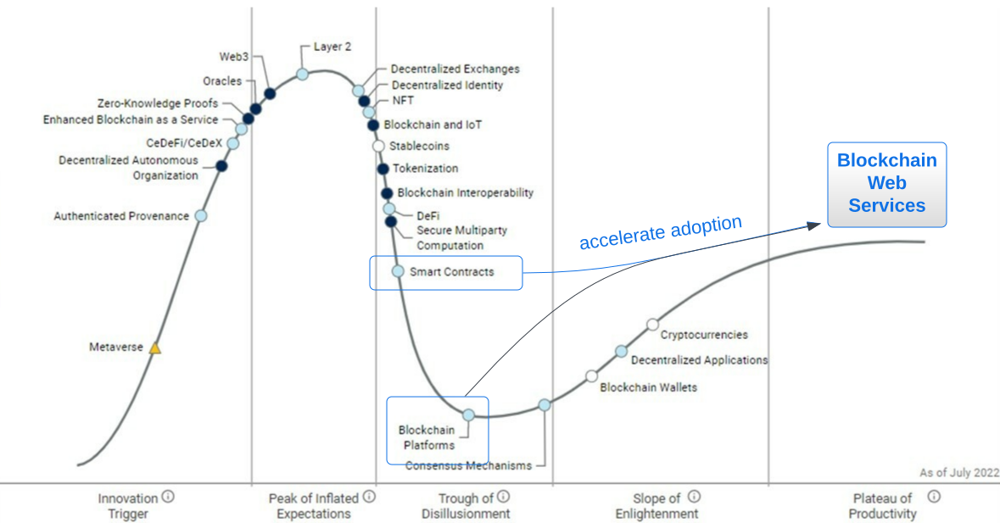
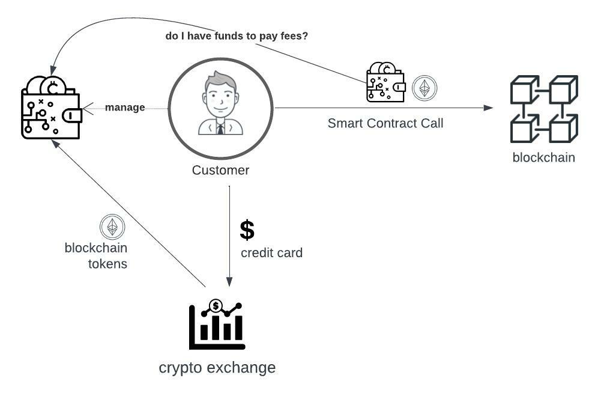
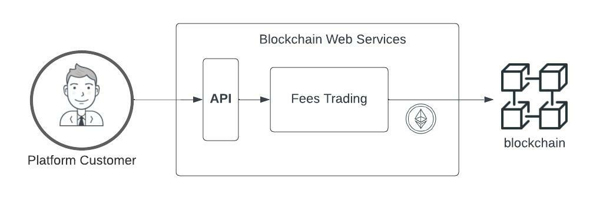

<link rel="stylesheet" href="https://cdnjs.cloudflare.com/ajax/libs/highlight.js/11.4.0/styles/atom-one-dark.min.css">

 White Paper

October the 1st, 2022.
 
Version 0.2 
  

Abstract

Blockchain Web Services is a unified API allowing companies to consume blockchain smart contracts as regular web services.

In addition to this, it also integrates a marketplace for developers to publish their smart contracts and for companies to access hundreds of validated and secured state-of-the-art blockchain solutions. 

We aim to help society embrace the blockchain revolution by removing infrastructure complexities from business creative workflows while improving decision-making “attributes of innovation”1 (Relative Advantage, Compatibility, Complexity, Triability, and Observability).

On the economics, Blockchain Web Services follows a sustainable economic and growth loop, where our ERC20 Ethereum token funds the platform’s development, rewards the community for extending it, and the revenue grows exponentially as more companies use the API.

   
  Figure 1. <i class="fa-solid fa-quote-left"></i>&nbsp;The Amazon Web Services for the blockchain(s)&nbsp;<i class="fa-solid fa-quote-right"></i>

_________

## Introduction

The first generation of blockchain (aka Bitcoin) delivered the required trust for financial transactions; Just a few years later, a second generation (aka Ethereum) stretched to countless scenarios through smart contracts. Today, new initiatives are already pushing hard to support scalability and mature growth.

But the initial hype on smart contracts is getting weighed by the blockchain ecosystem complexities(3), and challenges arise when discussing market adoption. Among other blockers, today, customers have to build their solution from scratch, find experienced developers, decide the infrastructure to use, secure their identity or manage how to pay network fees every time they execute a transaction.

The roadmap for getting any business value is too long; therefore, many companies decide blockchain needs to be more mature and easy to consume to get on board.

Blockchain Web Services brings an answer and a solution to all those blockchain adoption barriers.

   
  Figure 2. Gartner Hype Cycle for blockchain and Web3, 2022 (2).

## Problem Solving Proposition

To accelerate the smart contracts market adoption, we intend Blockchain Web Services to provide the following:

 <ul class="fa-ul">
  <li style="padding-bottom:10px;"><i class="fa-regular fa-square-check"></i><strong>A unified API platform</strong> for developers and companies to call public blockchain smart contracts as easily as any web service they are already used to.</li>
  <li style="padding-bottom:10px;"><i class="fa-regular fa-square-check"></i><strong>A marketplace</strong> for developers to extend the platform offering and for companies to find and consume smart contracts easily.</li>
</ul>

The marketplace incorporates built-in smart contracts for the most demanded use cases to get market traction from day one (database primitives, NFT (Non-Fungible Tokens), data assets management, and a supply chain solution to build auditable company workflows).

### A Unified blockchain(s) API

APIs are the preferred technology for building applications, and for this reason the global API market size is expected to reach USD 14 billion by 2030 and was worth USD 2.4 billion in 2021.

   
  Figure 3. API Market Size and Forecast.

We want that technology to also drive the growth of blockchain smart contracts and accelerate adoption, and we are building Blockchain Web Services API to fulfill the following principles:

 <ul class="fa-ul">
  <li style="padding-bottom:10px;"><i class="fa-regular fa-square-check"></i>Consuming a smart contract should be as easy as calling any other web service (Figure 4).</li>
  <li style="padding-bottom:10px;"><i class="fa-regular fa-square-check"></i>The same API interface should be used to call a smart contract in Ethereum, Polygon, Cardano, or any other supported blockchain.</li>
  <li style="padding-bottom:10px;"><i class="fa-regular fa-square-check"></i>Executing Blockchain Web Services API calls should not require buying coins or tokens.</li> 
  <li><i class="fa-regular fa-square-check"></i>The use of blockchain private wallets should only be required if it adds value to the solution proposal.</li> 
</ul>

<pre><code class="js">var parameters = {
  contract: "Ethereum.Database.Immutable",
  version: 2,
  network: "ropsten",
  operation: "insertBytes32",
  parameters: {
    key: "a-key",
    value: "Hello World!",
  },
};

$.ajax({
  method: "POST",
  url: "https://api.bws.ninja/v1/call",
  data: JSON.stringify(parameters),
  headers: {
    "Content-Type": "application/json",
    "X-Api-Key": "ExV0dDszQ8QgsTVnevddpbB8cUaAfPs432ntVF8g0",
  },
  dataType: "json",
  success: function (response) {
    console.log(response);
  },
  error: function (xhr, textStatus, errorThrown) {
    console.log(xhr);
  },
});</code></pre>

Figure 4. A Unified API Interface call example.

#### Realtime Fees Trading

To execute smart contracts and write into blockchain, you need fuel5. This is a fee required to execute transactions, like the fee you pay when using your credit card to support the network. 

For example, if a company wants to use smart contracts to write its document’s signatures in the blockchain (to add transparency and trust), every smart contract signing call will require funds to be available to pay for the blockchain network fees (Figure 5). 

   
  Figure 5. Customers managing Fees to call smart contracts.

At some point, company developers will have to deal with employing a credit card or bank account to buy ETH recurrently and estimate how much gas they require at any time. 

Blockchain Web Services implements an innovative approach. Our platform trades with any required funding in real-time, so users do not have to deal with it.

   
  Figure 6. Fees trading and Blockchain Web Services token circular economy.

Customers call the platform API as often as required, and pay a bill at the end of the period.

### A smart contract Marketplace Community

Blockchain communities are an essential element to driving continued growth.

When it comes to smart contracts, a unified approach from both developers as well as the companies looking for their services is essential in order for all parties to effectively grow and expand. It was in a recent article that Jack Dorsey, billionaire entrepreneur, said that it was the “network and community” behind cryptocurrency and blockchain projects which he sees as being the most crucial for advancement.

We incorporate a marketplace of smart contracts, where experienced blockchain developers will publish their work (and get a profit from it), and companies will find best-in-class solutions that are easy to use through our API approach.

   
  Figure 7. Blockchain Web Services Marketplace.

## Utility Token

Our goal is to boost overall blockchain adoption, whereby trust and transparency are maximized in order of benefit the community in as many ways as possible. We are hopeful that the community will be able to be a big part of the journey with us going forward.

We propose Blockchain Web Services to rule a token operating under the following principles:

- A circular token economy should support sustained growth.

- We aim to work for the vision we are committed to — a massive increase in blockchain adoption through companies, governments, and developers using our platform.

- The popularity of token dynamics' results from an increase in usage volume and real-world added value.

- We want the community to help, participate, fund, and get rewarded for promoting and extending the platform.

### Token Use Cases 

Blockchain Web Services has the following actors (as shown in Figure 8), 

-	Platform customers calling the API as part of their blockchain services offering.

-	smart contract developers and teams building new platform solutions (extending the API).

-	The platform team, whose objective is to develop the built-in solution APIs and engage the community.

   
  Figure 8. Utility token circular economy.

In order to build a circular economy, BWS token will get utilized as follows:

-	Every API call consuming a smart contract will require a payment fee in our utility token (such fee will also get transparently managed by the platform).

-	Marketplace smart contract creators (developers) will get token rewards every time a platform customer consumes their solution.

-	The smart contract developer’ community will get funds to add innovative solutions to the platform.

-	Tokens will fund the development, launch, and growth of the platform.

### Tokenomics 

<strong>Token Name</strong> 

Blockchain Web Services

<strong>Token Symbol</strong>

BWS 

<strong>Token Type</strong> 

ERC-20

<strong>Total Supply</strong>

1.1 billion - deflationary, no minting of new tokens

<strong>Token Allocation</strong>

We intend to have tokens support the platform's sustained growth, and this is the reason most of the tokens are allocated to product development, which also includes marketing and consultancy activities, and network rewards.

   
  Figure 9. Token Allocation.

<strong>Vesting Periods</strong>

The founder's allocation is subject to a one-year lockup post-network launch. After the lockup period ends, these tokens will vest monthly for another two years.

Early-stage investors have a nine-month lockup post-network launch. After the lockup period ends, these tokens will vest monthly for another six months.

<strong>Initial Sale Token Price</strong>

|  Seed |  Private |  Public |  
|---|---|---|
| $0.12  | $0.45  | $0.60  |  

<strong>Token Circular Loop</strong>

Tokens are bought for network usage and spent on network growth, creating a virtuous loop economy.

   
  Figure 10. Tokenomics Health Loop.

_________

## Roadmap

### [Q1 2022] **BASE STATION** - <i class="fa-solid fa-check"></i>

- Define middleware architecture.
- Middleware implementation for account creation, funding credits and smart-contracts calling:
  - [bws.ninja backoffice](https://bws.ninja/)
- Initial API documentation:
  - [doc.bws.ninja](https://doc.bws.ninja/)
- Activate Stripe for customers to buy USD credits.
  - Setup for bws.ninja staging [staging.bws.ninja](https://staging.bws.ninja)

### [Q2 2022] **THE ROCKETS** - <i class="fa-solid fa-check"></i>

- Ropsten ~~mining~~ PoS (update 18/06/2022) for users to freely test BWS services.
  - ~~[BWS Ropsten Address mining](https://ropsten.etherscan.io/address/0x9089Db83F0590EC2eD01A5Eb4F8584Dd6F4bDaC7#mine)~~
  - [BWS Ropsten PoS](https://ropsten.beaconcha.in/validator/877c91d2376f731a0f621c7848c0cd9d0a2622e91d68922838ef6b4dd5d8256e46e86cf06f5979b32103ed706d0c70ed)
- First Blockchain Web Services Product Service:
  - Database: [Ethereum.Database](https://github.com/NachoColl/blockchain-web-services/tree/Ethereum.Database.Immutable/contracts/ethereum)
- Deploy [Ethereum.Database](https://doc.bws.ninja/#database) to:
  - Ethereum (ropsten + mainnet)
- BWS Database product service use-case demo:
  - [MegaLock.ninja](https://megalock.ninja) (ropsten)

### [Q3 2022] **COUNT DOWN** - <i class="fa-solid fa-check"></i>

- Payment Gateways partening
  - Setup Stripe payments gateway
  - Setup FTX.us partnership
- Implement Realtime Fees Trading
- Website initial iteration.
  - [bws.ninja](https://bws.ninja/) copy & design

### [Q4 2022] **IGNITION**

- Deploy [Ethereum.Database] to zkEVM / zkSync 2.0 to lower fees
- Define Tokenomics.

### [Qx 2023] **LAUNCH**

- Seed Funding Event
- From MVP to version 1.0
  - Built-in solutions for:
    - Supply Chain Management
    - Data Assets / AI Workflows Integration
- Blockchain Web Services ADOPTION growth plan threads:
  - **blockchain Consulting** to help businesses implement blockchain through Blockchain Web Services 
  - **smart contracts Marketplace** to involve smart contracts developers to add their solutions.

   

#### references

(1) Diffusion of Innovations - Everett M. Rogers

(2) Gartner Hype Cycle for blockchain and Web3, 2022 - Gartner Research - https://blogs.gartner.com/avivah-litan/2022/07/22/gartner-hype-cycle-for-blockchain-and-web3-2022/ 

(3) blockchain Layer 1 vs. Layer 2 Scaling Solutions - Binance Academy - https://academy.binance.com/en/articles/blockchain-layer-1-vs-layer-2-scaling-solutions

(4) smart contract best practices - Cardano Foundation - https://docs.cardano.org/plutus/sc-best-practices

(5) How Gas Fees Work on the Ethereum blockchain - JAKE FRANKENFIELD - www.investopedia.com/terms/g/gas-ethereum.asp