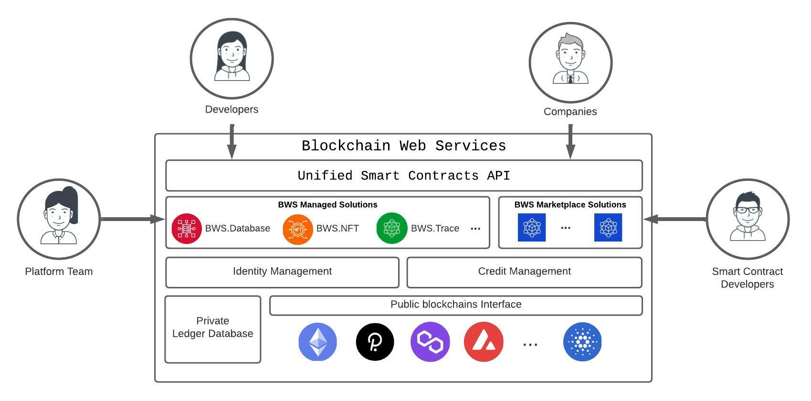

 

Blockchain technologies are rising at an incredible rate. The 1st generation (aka Bitcoin) delivered the required trust for _financial_ transactions; Just a few years later a 2nd generation (aka Ethereum) stretched to countless scenarios through the use of Smart Contracts; Now, a 3rd generation set of initiatives is already pushing hard to support scalability and mature growth.

We believe **blockchain should transform society for the better** and while cryptos have raised worldwide attention, the real win must come from Infinite Games founded on a global and trusted framework based on decentralized models and transparency: **blockchain beyond cryptos** must wake up shifts from-a-few to everyone.

## Blockchain Web Services

Blockchain Web Services will offer a set of services on top of blockchain(s) to help companies, individuals and governments embrace a new era of trusted services while keeping the focus on their business models and how they add value.

  

The same way Amazon Web Service (and other cloud providers) are transforming how companies consume IT infrastructure by delivering abstraction layers, Blockchain Web Services will transform how everyone interacts with Blockchain.

## Roadmap

### [Q1 2022] **BASE STATION** - <i class="fa-solid fa-check"></i>

- Define middleware architecture.
- Middleware implementation for account creation, funding credits and smart-contracts calling:
  - [bws.ninja backoffice](https://bws.ninja/)
- Initial API documentation:
  - [doc.bws.ninja](https://doc.bws.ninja/)
- Activate Stripe for customers to buy USD credits.
  - Setup for bws.ninja staging [staging.bws.ninja](https://staging.bws.ninja)

### [Q2 2022] **THE ROCKET** - <i class="fa-solid fa-check"></i>

- Ropsten ~~mining~~ PoS (update 18/06/2022) for users to freely test BWS services.
  - [BWS Ropsten Address mining](https://ropsten.etherscan.io/address/0x9089Db83F0590EC2eD01A5Eb4F8584Dd6F4bDaC7#mine)
- First Blockchain Web Services Product Service:
  - Database: [Ethereum.Database](https://github.com/NachoColl/blockchain-web-services/tree/Ethereum.Database.Immutable/contracts/ethereum)
- Deploy [Ethereum.Database](https://doc.bws.ninja/#database) to:
  - Ethereum (ropsten + mainnet)
- BWS Database product service use-case demo:
  - [MegaLock.ninja](https://megalock.ninja) (ropsten)

### [Q3 2022] **COUNT DOWN**

- Implement ETH trading to call mainnet Smart contracts
  - Setup Stripe payments in bws.ninja production
  - Setup FTX.us partnership
  - Implement Trading middleware
- Deploy [Ethereum.Database] to:
  - Polygon
- Implement new Product Services
  - **NFT** for NFT use cases.
- Website initial iteration.
  - [bws.ninja](https://bws.ninja/) copy & design

### [Q4 2022] **MOON LANDING**

- Implement new Product Services
  - **Trace** for Supply Chain Management
- Blockchain Web Services DAO
- First online service consuming Blockchain Web Services products.
