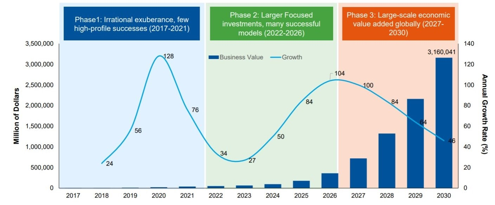

<link rel="stylesheet" href="https://cdnjs.cloudflare.com/ajax/libs/highlight.js/11.4.0/styles/atom-one-dark.min.css">

 White Paper

(version under construction)

Abstract

Blockchain Web Services is a Unified Smart Contracts API enabling companies to consume blockchain Smart Contracts as regular web services.

In addition, it also incorporates a Marketplace for developers to publish their Smart Contracts and for companies to get access to hundreds of validated and secured state-of-the-art blockchain solutions.

We aim to help companies build on top of Smart Contracts and embrace the blockchain revolution. We remove infrastructure complexities from creative workflows while improving decision-making "attributes of innovation"1 (Relative Advantage, Compatibility, Complexity, Triability, and Observability).

Regarding sustainability, Blockchain Web Services follows a sustainable economic and growth loop: our ERC20 Ethereum token funds the platform's-building and rewards the community for extending it, while the revenue grows exponentially when new companies use the Unified Smart Contracts API.

_________

## Introduction

Blockchain technologies are rising at an incredible rate. The 1st generation (aka Bitcoin) delivered the required trust for financial transactions; Just a few years later, a 2nd generation (aka Ethereum) stretched to countless scenarios through Smart Contracts. Today, a set of new initiatives is already pushing hard to support scalability and mature growth.

But the initial hype on Smart Contracts is getting weighed by the blockchain ecosystem complexities, and challenges arise when discussing market adoption.

   
Gartner - Despite the fast growth of the blockchain ecosystem,  its complexity makes it difficult to navigate for business leaders (2).

<mark>[extend/improve] 
improve overall understanding of following:
</mark>

The learning curves are still massive for companies planning to go blockchain, and the absence of unified standards is still a leading blocker. While the portfolio of blockchain(s) layered infrastructures(3) and Smart Contracts is growing fast, companies require a stable ecosystem to focus on their value proposal and improve implementation cost efficiency (does a contract that does the same thing already exist(4)?).

### Trust and Transparency

<mark>[create]
 
public blockchains as the solution to go vs. private blockchains, as it's all about trust and transparency (transparency = public)!
</mark>

## Problem Solving Proposition

<mark>[extend/improve] 
|| add more intro text
</mark>

Blockchain Web Services provides a solution to raise blockchain adoption by delivering:

 <ul class="fa-ul">
  <li><i class="fa-regular fa-square-check"></i>A Unified Smart Contracts API for developers and companies to use public Blockchain(s) as any Web Service they are already used to.</li>
  <li><i class="fa-regular fa-square-check"></i>Real-time Blockchain fees trading to transparently manage funds required to call Smart Contracts(5) .</li>
  <li><i class="fa-regular fa-square-check"></i>Platform built-in Smart Contracts for the most demanded use cases (initial launch is planned to include Database primitives — read and write data to the blockchain(s), Data Assets, and Supply Chain solutions).</li> 
  <li><i class="fa-regular fa-square-check"></i>A Marketplace for developers to get rewarded when adding new Smart Contracts and for companies to find and consume Smart Contracts easily.</li>
</ul>

 

   
<i class="fa-solid fa-quote-left"></i>&nbsp;The Amazon Web Services for the Blockchain(s)&nbsp;<i class="fa-solid fa-quote-right"></i>

### A Unified Blockchain(s) API

<mark>[extend/improve] 
|| add intro text
|| include API economy text, references and market volume
</mark>

Figure 1 shows Blockchain Web Services Unified API aims:

- Consuming a Smart Contract should be as easy as calling any other web service.
- The use of blockchain private addresses or secrets is only required when adding value to the solution proposal.
- The same interface is used to call a Smart Contract in Ethereum, Polygon, Cardano, or any other supported blockchain.
- Calling the API does not require buying any coin or token.

 

<pre><code class="js">var parameters = {
  contract: "Ethereum.Database.Immutable",
  version: 2,
  network: "ropsten",
  operation: "insertBytes32",
  parameters: {
    key: "a-key",
    value: "Hello World!",
  },
};

$.ajax({
  method: "POST",
  url: "https://api.bws.ninja/v1/call",
  data: JSON.stringify(parameters),
  headers: {
    "Content-Type": "application/json",
    "X-Api-Key": "ExV0dDszQ8QgsTVnevddpbB8cUaAfPs432ntVF8g0",
  },
  dataType: "json",
  success: function (response) {
    console.log(response);
  },
  error: function (xhr, textStatus, errorThrown) {
    console.log(xhr);
  },
});</code></pre>

<strong>Figure 1: A Unified API Interface call example.</strong>

### Realtime Fees Trading

<mark>[improve writing ]</mark>

To execute Smart Contracts and write into Blockchain, you need fuel - that will cost you some money (5). If a company wants to write in Blockchain their contract's signatures, every signature operation call will require the company to have some funds available. If they use the Ethereum blockchain, they will have to manage how to buy some ETH just before every call (fiat exchange value may go up or down in time).

Blockchain Web Services executes any required funding real-time so users don't have to deal with it.

   
  <strong>Figure 2: Fees trading and Blockchain Web Services token circular economy.</strong>

<mark>[extend/improve] 
|| add more/improved text </mark>

Platform customers pay a bill at the end of the period as they currently do when consuming any other online service.

## A Smart Contract Marketplace Community

<mark>[replace/extend]</mark>

As previously mentioned, we will provide solutions that satisfy some of the market's most demanded use cases. We will start our journey by adding Database primitives to read and write data to the blockchain(s) and move up by adding a Supply Chain Management API or offering a Data/AI assets solution, among others.

Even more exciting, we want to engage ourselves in the community-embracing approach the blockchain revolution has introduced. 

We will build a Marketplace of Smart Contracts where experienced blockchain developers will publish their work and be able to get a profit from it - and companies will be able to consume an extended set of solutions as part of Blockchain Web Services API. 

## Utility Token

We propose Blockchain Web Services to rule a token operating under the following principles:

- We want the community to help, participate, fund, and get rewarded for promoting and extending the platform.

- We aim to work for the vision we committed to — a massive increase in blockchain adoption through companies and governments consuming platform solutions, and token dynamics are conceived such that health rises with usage volume.

### Token Use Cases 

Blockchain Web Services token will get utilized for:

- API consumers (platform customers) will require the token to execute Smart Contracts API calls.

  

- Marketplace Smart Contracts creators (Smart Contracts solution developers) will get a token reward whenever a platform customer consumes their solution.

  

- Smart Contract developers will get funds to add new solutions to the platform.

  

- Fund the development and launch of the platform.

### Tokenomics 

<mark>[under construction]</mark>

We aim to boost the overall Blockchain adoption, meaning we want the community to benefit from the values it implies. And we want the same community to be able to participate and be part of the journey with us. 

#### Token Launch Events

There will be a Seed, a Pre-Launch, and a Public launch event.

The public launch will run one year after the Seed event - the roadmap is running as planned, but we want a tangible token valuation when the public launch arrives.

_________

## Roadmap

### [Q1 2022] **BASE STATION** - <i class="fa-solid fa-check"></i>

- Define middleware architecture.
- Middleware implementation for account creation, funding credits and smart-contracts calling:
  - [bws.ninja backoffice](https://bws.ninja/)
- Initial API documentation:
  - [doc.bws.ninja](https://doc.bws.ninja/)
- Activate Stripe for customers to buy USD credits.
  - Setup for bws.ninja staging [staging.bws.ninja](https://staging.bws.ninja)

### [Q2 2022] **THE ROCKETS** - <i class="fa-solid fa-check"></i>

- Ropsten ~~mining~~ PoS (update 18/06/2022) for users to freely test BWS services.
  - ~~[BWS Ropsten Address mining](https://ropsten.etherscan.io/address/0x9089Db83F0590EC2eD01A5Eb4F8584Dd6F4bDaC7#mine)~~
  - [BWS Ropsten PoS](https://ropsten.beaconcha.in/validator/877c91d2376f731a0f621c7848c0cd9d0a2622e91d68922838ef6b4dd5d8256e46e86cf06f5979b32103ed706d0c70ed)
- First Blockchain Web Services Product Service:
  - Database: [Ethereum.Database](https://github.com/NachoColl/blockchain-web-services/tree/Ethereum.Database.Immutable/contracts/ethereum)
- Deploy [Ethereum.Database](https://doc.bws.ninja/#database) to:
  - Ethereum (ropsten + mainnet)
- BWS Database product service use-case demo:
  - [MegaLock.ninja](https://megalock.ninja) (ropsten)

### [Q3 2022] **COUNT DOWN** - <i class="fa-solid fa-check"></i>

- Payment Gateways partening
  - Setup Stripe payments gateway
  - Setup FTX.us partnership
- Implement Realtime Fees Trading
- Website initial iteration.
  - [bws.ninja](https://bws.ninja/) copy & design

### [Q4 2022] **IGNITION**

- Deploy [Ethereum.Database] to zkEVM / zkSync 2.0 to lower fees
- Define Tokenomics.

### [Qx 2023] **LAUNCH**

- Seed Funding Event
- From MVP to version 1.0
  - Built-in solutions for:
    - Supply Chain Management
    - Data Assets / AI Workflows Integration
- Blockchain Web Services ADOPTION growth plan threads:
  - **Blockchain Consulting** to help businesses implement blockchain through Blockchain Web Services 
  - **Smart Contracts Marketplace** to involve Smart Contracts developers to add their solutions.

   

#### references

(1) Diffusion of Innovations - Everett M. Rogers

(2) Gartner’s 2021 CIO survey & Digital Disruption Profile: Blockchain’s Radical Promise Spans Business and Society - Gartner Research - Rajesh Kandaswamy, David Furlonger, Andrew Stevens

(3) Blockchain Layer 1 vs. Layer 2 Scaling Solutions - Binance Academy - https://academy.binance.com/en/articles/blockchain-layer-1-vs-layer-2-scaling-solutions

(4) smart contract best practices - Cardano Foundation - https://docs.cardano.org/plutus/sc-best-practices

(5) How Gas Fees Work on the Ethereum Blockchain - JAKE FRANKENFIELD - www.investopedia.com/terms/g/gas-ethereum.asp