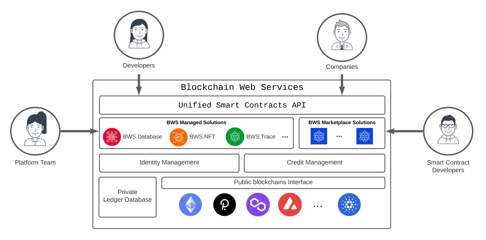

<link rel="stylesheet" href="https://cdnjs.cloudflare.com/ajax/libs/highlight.js/11.4.0/styles/atom-one-dark.min.css">

 White Paper

October the 1st, 2022.
 
Version 1.
  

Abstract

Blockchain Web Services is a Unified Smart Contracts API allowing companies to consume blockchain Smart Contracts as regular web services.

It also integrates a Marketplace for developers to publish their Smart Contracts and for companies to access hundreds of validated and secured state-of-the-art blockchain solutions. 

We aim to help society embrace the blockchain Trust & Transparency revolution by removing infrastructure complexities from business creative workflows while improving decision-making “attributes of innovation”1 (Relative Advantage, Compatibility, Complexity, Triability, and Observability).

On the economics, Blockchain Web Service follows a sustainable economic and growth loop, where our ERC20 Ethereum token funds the platform’s development, rewards the community for extending it, and the revenue grows exponentially as more companies use the API.

   
  Figure 1. <i class="fa-solid fa-quote-left"></i>&nbsp;The Amazon Web Services for the Blockchain(s)&nbsp;<i class="fa-solid fa-quote-right"></i>

_________

## Introduction

The 1st generation of Blockchain (aka Bitcoin) delivered the required trust for financial transactions; Just a few years later, a 2nd generation (aka Ethereum) stretched to countless scenarios through Smart Contracts. Today, a set of new initiatives is already pushing hard to support scalability and mature growth.

But the initial hype on Smart Contracts is getting weighed by the blockchain ecosystem complexities, and challenges arise when discussing market adoption. While the portfolio of blockchain infrastructures(3) and the number of deployed Smart Contracts is growing fast, companies are reluctant to start their journey as it is too complex for them to manage the technology requirements. 

Which Blockchain should I choose? How do I manage my Wallet and pay recurrent network fees? Should I build my Smart Contracts from scratch? Can we build on top of Blockchain as we're used to developing applications today? Are there state-of-the-art blockchain solutions ready to use? 

Blockchain Web Services brings an answer and a solution to those questions.

   
  Figure 2. Gartner Hype Cycle for Blockchain and Web3, 2022 (2).

## Problem Solving Proposition

To accelerate the Smart Contracts market adoption, we intend Blockchain Web Services to provide:

 <ul class="fa-ul">
  <li style="padding-bottom:10px;"><i class="fa-regular fa-square-check"></i><strong>A Unified API platform</strong> for developers and companies to call public Blockchain(s) Smart Contracts as any Web Service they are already used to.</li>
  <li style="padding-bottom:10px;"><i class="fa-regular fa-square-check"></i><strong>A Marketplace</strong> for developers to extend the platform offering and for companies to find and consume Smart Contracts easily.</li>
  <li><i class="fa-regular fa-square-check"></i><strong>Built-in Smart Contracts</strong> for the most demanded use cases (initial launch is planned to include Database primitives — read and write data to the blockchain(s), NFT (Non-Fungible Tokens) & Data Assets management Smart Contracts, and a Supply Chain solution to build auditable company workflows).</li> 
</ul>

### A Unified Blockchain(s) API

APIs are the preferred technology to build applications, and the reason <strong>the global API market size is expected to reach USD 14 billion by 2030</api> and was worth USD 2.4 billion in 2021.

   
  Figure 3. API Market Size and Forecast.

We want that technology also to drive Blockchain Smart Contracts growth and accelerate adoption, and we are building Blockchain Web Services API to fulfill the following principles:

 <ul class="fa-ul">
  <li style="padding-bottom:10px;"><i class="fa-regular fa-square-check"></i>Consuming a Smart Contract should be as easy as calling any other Web Service (Figure 4).</li>
  <li style="padding-bottom:10px;"><i class="fa-regular fa-square-check"></i>The same API interface should be used to call a Smart Contract in Ethereum, Polygon, Cardano, or any other supported blockchain.</li>
  <li style="padding-bottom:10px;"><i class="fa-regular fa-square-check"></i>Executing Blockchain Web Services API calls should not require buying coins or tokens.</li> 
  <li><i class="fa-regular fa-square-check"></i>The use of blockchain private wallets should only be required if adding value to the solution proposal.</li> 
</ul>

Any company or developer can start using Blockchain Web Services API without previous knowledge of Blockchain or Smart Contracts and without having to secure a Wallet or exchange USD to pay transaction fees.

<pre><code class="js">var parameters = {
  contract: "Ethereum.Database.Immutable",
  version: 2,
  network: "ropsten",
  operation: "insertBytes32",
  parameters: {
    key: "a-key",
    value: "Hello World!",
  },
};

$.ajax({
  method: "POST",
  url: "https://api.bws.ninja/v1/call",
  data: JSON.stringify(parameters),
  headers: {
    "Content-Type": "application/json",
    "X-Api-Key": "ExV0dDszQ8QgsTVnevddpbB8cUaAfPs432ntVF8g0",
  },
  dataType: "json",
  success: function (response) {
    console.log(response);
  },
  error: function (xhr, textStatus, errorThrown) {
    console.log(xhr);
  },
});</code></pre>

Figure 4. A Unified API Interface call example.

#### Realtime Fees Trading

To execute Smart Contracts and write into Blockchain, you need fuel5. It is a fee required to execute transactions, like the fee you pay when using your credit card to support the network. 

As an example, if a company wants to use Smart Contracts to write its document’s signatures in the blockchain (to add transparency and trust), every Smart Contract signing call will require funds to be available to pay for the blockchain network fees (Figure 5). 

At some point, company developers will have to deal with employing a credit card or bank account to buy ETH recurrently and estimate how much gas they require at any time. 

   
  Figure 5. Customers managing Fees to call Smart Contracts.

Blockchain Web Services implements an innovative approach: the platform trades with any required funding in real-time, so users do not have to deal with it.

   
  Figure 6. Fees trading and Blockchain Web Services token circular economy.

Customers call the platform API as much as required, wihout having to worry about blockchain fundings, and pay a bill at the end of the period as they currently do when utilizing any other online service or API. 

## A Smart Contract Marketplace Community

To build a loop of sustained platform growth, Blockchain Web Services’ offering needs to grow as fast as new blockchain opportunities arise. 

We incorporate a Marketplace of Smart Contracts where experienced blockchain developers will publish their work (and get a profit from it), and companies will find best-in-class solutions that are easy to use through our platform Smart Contracts API approach.

   
  Figure 7. Blockchain Web services Marketplace.

## Utility Token

We propose Blockchain Web Services to rule a token operating under the following principles:

- Circular token economy should support <strong>sustained growth</strong>.

- We aim to work for the vision we are committed to — <strong>a massive increase in blockchain adoption</strong> through companies, governments, and developers using our platform.

- We want <strong>the community to help, participate, fund, and get rewarded</strong> for promoting and extending the platform.

### Token Use Cases 

Blockchain Web Services has the following actors, 

-	Platform customers calling the API as part of their Blockchain services offering.

-	Smart Contract developers and teams building new platform solutions (extending the API).

-	The platform team, whose objective is to develop the built-in solution APIs and engage the community.

   
  Figure 8. Utility token circular economy.

To build a circular economy, Blockchain Web Services token will get utilized as shown in Figure 7 use cases:

-	Every API call consuming a Smart Contract will require paying a fee in our utility token (such fee charge will also get transparently managed by the platform).

-	Marketplace Smart Contracts creators (developers) will get token rewards every time a platform customer consumes their solution.

-	Smart Contract developers’ community will get funds to add innovative solutions to the platform.

-	Token will fund the development, launch, and growth of the platform.

### Tokenomics 

<strong>Token type</strong> 

ERC-20

<strong>Total Supply</strong>

1.1 billion - deflationary, no minting of new tokens

<strong>Token Allocation</strong>

   
  Figure 9. Token Allocation.

<strong>Vesting Periods</strong>

The founder's allocation is subject to a nine-month lockup post-network launch. After the lockup period ends, these tokens will vest monthly for another two years.

Early-stage investors have a six-month lockup post-network launch. After the lockup period ends, these tokens will vest monthly for another six months.

<strong>Initial Sale Token Price</strong>

|  Seed |  Private |  Public |  
|---|---|---|
| $0.12  | $0.45  | $0.60  |  

<strong>Token Circular Loop</strong>

   
  Figure 10. Tokenomics Health Loop.

_________

## Roadmap

### [Q1 2022] **BASE STATION** - <i class="fa-solid fa-check"></i>

- Define middleware architecture.
- Middleware implementation for account creation, funding credits and smart-contracts calling:
  - [bws.ninja backoffice](https://bws.ninja/)
- Initial API documentation:
  - [doc.bws.ninja](https://doc.bws.ninja/)
- Activate Stripe for customers to buy USD credits.
  - Setup for bws.ninja staging [staging.bws.ninja](https://staging.bws.ninja)

### [Q2 2022] **THE ROCKETS** - <i class="fa-solid fa-check"></i>

- Ropsten ~~mining~~ PoS (update 18/06/2022) for users to freely test BWS services.
  - ~~[BWS Ropsten Address mining](https://ropsten.etherscan.io/address/0x9089Db83F0590EC2eD01A5Eb4F8584Dd6F4bDaC7#mine)~~
  - [BWS Ropsten PoS](https://ropsten.beaconcha.in/validator/877c91d2376f731a0f621c7848c0cd9d0a2622e91d68922838ef6b4dd5d8256e46e86cf06f5979b32103ed706d0c70ed)
- First Blockchain Web Services Product Service:
  - Database: [Ethereum.Database](https://github.com/NachoColl/blockchain-web-services/tree/Ethereum.Database.Immutable/contracts/ethereum)
- Deploy [Ethereum.Database](https://doc.bws.ninja/#database) to:
  - Ethereum (ropsten + mainnet)
- BWS Database product service use-case demo:
  - [MegaLock.ninja](https://megalock.ninja) (ropsten)

### [Q3 2022] **COUNT DOWN** - <i class="fa-solid fa-check"></i>

- Payment Gateways partening
  - Setup Stripe payments gateway
  - Setup FTX.us partnership
- Implement Realtime Fees Trading
- Website initial iteration.
  - [bws.ninja](https://bws.ninja/) copy & design

### [Q4 2022] **IGNITION**

- Deploy [Ethereum.Database] to zkEVM / zkSync 2.0 to lower fees
- Define Tokenomics.

### [Qx 2023] **LAUNCH**

- Seed Funding Event
- From MVP to version 1.0
  - Built-in solutions for:
    - Supply Chain Management
    - Data Assets / AI Workflows Integration
- Blockchain Web Services ADOPTION growth plan threads:
  - **Blockchain Consulting** to help businesses implement blockchain through Blockchain Web Services 
  - **Smart Contracts Marketplace** to involve Smart Contracts developers to add their solutions.

   

#### references

(1) Diffusion of Innovations - Everett M. Rogers

(2) Gartner Hype Cycle for Blockchain and Web3, 2022 - Gartner Research - https://blogs.gartner.com/avivah-litan/2022/07/22/gartner-hype-cycle-for-blockchain-and-web3-2022/ 

(3) Blockchain Layer 1 vs. Layer 2 Scaling Solutions - Binance Academy - https://academy.binance.com/en/articles/blockchain-layer-1-vs-layer-2-scaling-solutions

(4) smart contract best practices - Cardano Foundation - https://docs.cardano.org/plutus/sc-best-practices

(5) How Gas Fees Work on the Ethereum Blockchain - JAKE FRANKENFIELD - www.investopedia.com/terms/g/gas-ethereum.asp